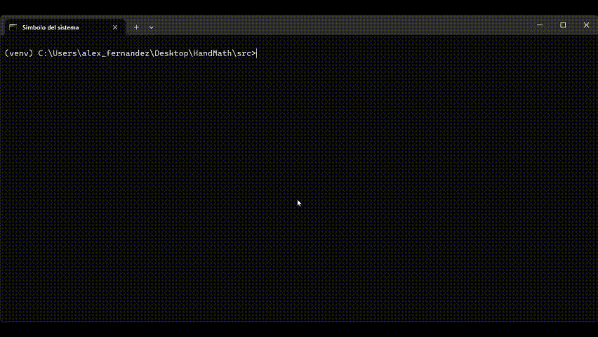
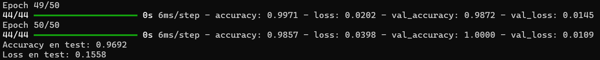

# 🧮 Clasificador de Operaciones Matemáticas con TensorFlow

En este proyecto se ha implementado un modelo de red neuronal capaz de clasificar y realizar operaciones matemáticas simples en sus respectivas categorías (suma, resta, división, multiplicación) identificando la posición de la mano e interpretándola como un número.

Incluye todo el flujo: desde la preparación del dataset, la normalización de datos, entrenamiento del modelo y evaluación de resultados.

---

# 🎥 Demo

### Paso 1. Creación de datos de entrenamiento:

```bash
python src/capture_data.py
```

Flujo:

* Fase 1: Posicionar la mano mostrando un número.

* Fase 2: Pulsar la tecla que corresponde al número para generar la etiqueta.

* Fase 3: Repetir fase 1 y 2 tantas veces como se desee.

* Fase 4: Pulsar tecla "q" para finalizar ejecución y generar archivo de datos.


### Paso 2. Normalización de datos

```bash
python src/normalize.py
```

Flujo:

* Fase 1: Convertir puntos a matriz. Cada punto tiene 3 coordenadas (X, Y, Z), y en cada captura de la mano hay 21 puntos (landmarks). Se organiza en matriz 21x3 para manipular más fácil.

* Fase 2: Normalización. Se establece el centro en el punto de la muñeca y se escala según la distancia máxima. Esto permite que no afecte el tamaño de la mano ni la distancia a la cámara. 

* Fase 3: Convertir la matriz a vector. Se "aplasta" la matriz para obtener un vector plano (1D) ya que es el tipo de dato que espera como entrada una red neuronal.


### Paso 3. Entrenamiento red neuronal:

```bash
python src/neuronal_network.py
``` 




### Paso 4. Demostración en tiempo real: 

```bash
python src/hand_calc.py
``` 

Flujo:

* Fase 1: Mostrar primer número con la mano → ENTER (confirmar).

* Fase 2: Seleccionar operación con la mano (1:+ 2:- 3:/ 4:*) → ENTER.

* Fase 3: Mostrar segundo número → ENTER.

* Fase 4: Resultado en pantalla. ENTER para reiniciar.


---

# ✨ Características principales

Entrenamiento con dataset propio generado programáticamente.

Normalización de datos para un mejor rendimiento del modelo.

Codificación one-hot de etiquetas para clasificación multiclase.

Implementado con TensorFlow y Keras.

Cada script realiza una función específica: generación de datos, normalización, entrenamiento y demostración. Esto permite reutilizar y modificar partes sin afectar todo el flujo.

Código modular y fácil de ampliar con más operaciones o complejidad.

---

# 📁 Estructura del proyecto

La carpeta principal incluye todo lo necesario para reproducir y entrenar el modelo:

src/capture_data.py → Generación de datos. Mostrar un número con la mano y pulsar su tecla correspondiente para generar la etiqueta.

src/normalize.py → Normalización y preparación de datos de entrada.

src/neuronal_network.py → Entrenamiento de red neuronal.

src/hand_calc.py → Detección en tiempo real de posición de la mano y operación matemática.

utils/ → Funciones auxiliares para carga de datos y procesamiento.

artifacts/scaler.save → Objeto guardado del escalador utilizado para normalización (para inferencia futura).

requirements.txt → Lista de dependencias necesarias.

---

# 🛠️ Instalación

### Requisitos previos

Python 3.10 instalado

Cámara 

### Crear entorno virtual con Anaconda (opcional pero recomendado)

```bash
conda create -n calc_nn python=3.10

conda activate calc_nn
```

### Instalar dependencias

```bash
pip install --upgrade pip

pip install -r requirements.txt
```

---

# 🚀 Entrenamiento y Resultados

### Modelo entrenado con:

**Datos**: Conjunto de datos de 400 muestras

**División de datos**: 80% entrenamiento y 20% test

**Capa oculta**: 64 neuronas (ReLU)

**Capa de salida**: Softmax para clasificación

**Épocas**: 50

**Optimizer**: Adam

**Loss**: Categorical Crossentropy

---

# 📊 Precisión final: 

**Precisión en test**: 96,92%

**Loss en test**: 0,1558

El modelo muestra un alto rendimiento en la clasificación de operaciones matemáticas simples.



---

# 🔍 Tecnologías y Habilidades

### Tecnologías utilizadas:

**Python 3.10** – Lenguaje principal del proyecto.

**TensorFlow y Keras** – Para construcción y entrenamiento de redes neuronales.

**OpenCV** – Captura de imágenes y manipulación de video en tiempo real.

**Pandas & Numpy** – Procesamiento y normalización de datos.


### Habilidades desarrolladas:

Preparación y normalización de datos para redes neuronales.

Diseño, entrenamiento y evaluación de modelos de clasificación multiclase.

Uso de técnicas de codificación one-hot y escalado de datos.

Implementación de inferencia en tiempo real con cámara web.

Organización modular del código y manejo de dependencias.

---


# 📌 Notas

El modelo de demostración se entrenó inicialmente con más neuronas y épocas, pero se detectó que se podía conseguir el mismo rendimiento con un modelo más eficiente, por lo que se ajustaron los parámetros.

Es importante que el modelo reciba una cantidad balanceada de muestras de todas las clases para lograr un rendimiento adecuado en la clasificación. 

El proyecto no incluye los modelos, escaladores y datos generados para realizar la demostración. Se puede obtener una aplicación funcional seguiendo los pasos del apartado Demo siempre que se genere un conjunto de datos suficiente. 

---

# 📜 Licencia
Todos los derechos reservados.